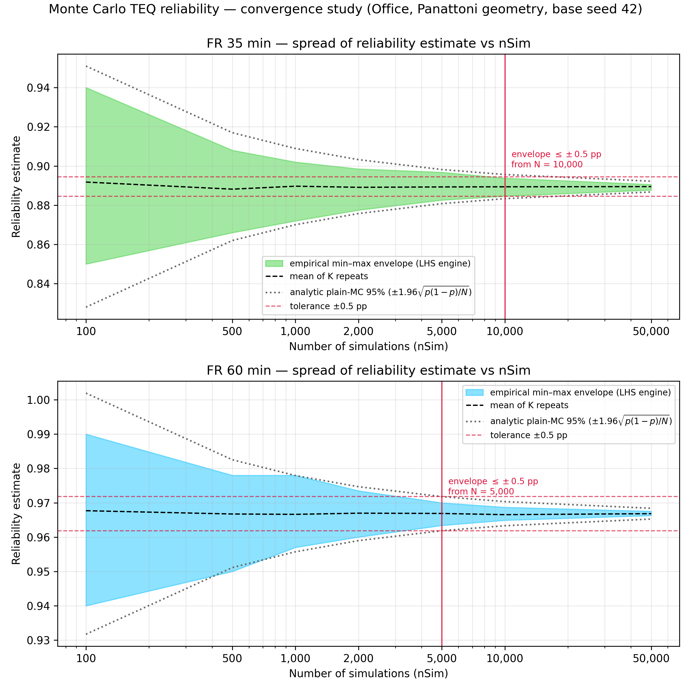

# Monte Carlo TEQ reliability — convergence study

*Scenario:* Panattoni benchmark (Office 64x13x3.5, one openable wall, sect 135, b=1200, 500C, no factors). *Base seed:* 42. *Runtime:* 4406 s. *Repeats per nSim (K):* {'100': 100, '500': 100, '1000': 100, '2000': 100, '5000': 100, '10000': 50, '50000': 25}.

For each nSim the full reliability run was repeated K times with independent
seeds; the spread of the K estimates measures run-to-run variability at that
nSim. The chart shows the empirical min–max envelope of the K repeats (the
measure used by the precedent CFDOpenPlan appendix study). The 95 %
percentile band is tabulated as a supplementary, K-stable measure; the
recommendation rule runs on the (wider, conservative) envelope.

Tolerance used: envelope half-width ≤ ±0.5% (a guide value, not a hard requirement; all ± values are absolute differences in the reliability percentage).

**Definitions.** *Envelope*: the measured random scatter — the range from
the lowest to the highest answer seen across the K repeats at one nSim
(the shaded band on the chart); half of it is the "min–max half-width".
*95 % band half-width*: as above but using the middle 95 % of the K
repeats instead of the extremes (narrower, less sensitive to one-off
outliers; supplementary only). *K*: how many times the whole reliability
run was repeated, with different random seeds, at each nSim.

| FR (min) | nSim | K | mean | min–max half-width | 95% band half-width |
|---|---|---|---|---|---|
| 35 | 100 | 100 | 89.18% | ±4.50% | ±3.76% |
| 35 | 500 | 100 | 88.82% | ±2.10% | ±1.65% |
| 35 | 1,000 | 100 | 88.97% | ±1.50% | ±1.23% |
| 35 | 2,000 | 100 | 88.91% | ±1.05% | ±0.84% |
| 35 | 5,000 | 100 | 88.93% | ±0.71% | ±0.52% |
| 35 | 10,000 | 50 | 88.94% | ±0.46% | ±0.37% |
| 35 | 50,000 | 25 | 88.95% | ±0.14% | ±0.14% |
| 60 | 100 | 100 | 96.77% | ±2.50% | ±2.26% |
| 60 | 500 | 100 | 96.67% | ±1.40% | ±1.05% |
| 60 | 1,000 | 100 | 96.66% | ±1.05% | ±0.78% |
| 60 | 2,000 | 100 | 96.70% | ±0.68% | ±0.51% |
| 60 | 5,000 | 100 | 96.69% | ±0.33% | ±0.28% |
| 60 | 10,000 | 50 | 96.65% | ±0.19% | ±0.18% |
| 60 | 50,000 | 25 | 96.68% | ±0.06% | ±0.06% |

## Recommendation

- FR 35 min: min–max envelope half-width first within ±0.5% at **nSim = 10,000**.
- FR 60 min: min–max envelope half-width first within ±0.5% at **nSim = 5,000**.
