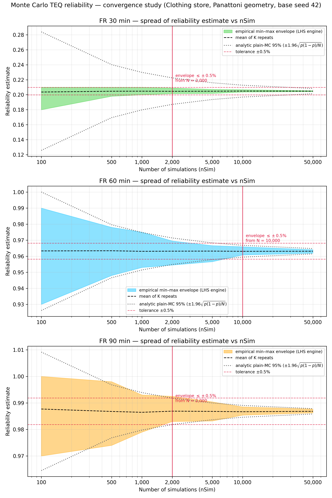

# Monte Carlo TEQ reliability — convergence study

*Scenario:* Panattoni benchmark (Clothing store 64x13x3.5, one openable wall, sect 135, b=1200, 500C, no factors). *Base seed:* 42. *Runtime:* 7423 s. *Repeats per nSim (K):* {'100': 100, '500': 100, '1000': 100, '2000': 100, '5000': 100, '10000': 50, '50000': 25}.

For each nSim the full reliability run was repeated K times with independent
seeds; the spread of the K estimates measures run-to-run variability at that
nSim. The chart shows the empirical min–max envelope of the K repeats (the
measure used by the precedent CFDOpenPlan appendix study) beside the analytic
plain-Monte-Carlo 95 % interval ±1.96·√(p(1−p)/N) — the engine samples by
Latin Hypercube, so its empirical envelope is expected to sit inside the
analytic curve. The 95 % percentile band is tabulated as a supplementary,
K-stable measure; the acceptance rule runs on the (wider, conservative)
envelope.

Tolerance used: envelope half-width ≤ ±0.5% (all ± values are absolute differences in the reliability percentage).

| FR (min) | nSim | K | mean | min–max half-width | 95% band half-width | analytic 1.96·SE |
|---|---|---|---|---|---|---|
| 30 | 100 | 100 | 20.36% | ±1.50% | ±1.00% | ±7.91% |
| 30 | 500 | 100 | 20.47% | ±0.60% | ±0.50% | ±3.54% |
| 30 | 1,000 | 100 | 20.47% | ±0.50% | ±0.38% | ±2.50% |
| 30 | 2,000 | 100 | 20.46% | ±0.37% | ±0.29% | ±1.77% |
| 30 | 5,000 | 100 | 20.47% | ±0.27% | ±0.17% | ±1.12% |
| 30 | 10,000 | 50 | 20.49% | ±0.16% | ±0.12% | ±0.79% |
| 30 | 50,000 | 25 | 20.48% | ±0.06% | ±0.05% | ±0.35% |
| 60 | 100 | 100 | 96.33% | ±3.00% | ±2.50% | ±3.69% |
| 60 | 500 | 100 | 96.34% | ±1.50% | ±1.11% | ±1.65% |
| 60 | 1,000 | 100 | 96.31% | ±1.10% | ±0.85% | ±1.17% |
| 60 | 2,000 | 100 | 96.31% | ±0.75% | ±0.63% | ±0.83% |
| 60 | 5,000 | 100 | 96.32% | ±0.50% | ±0.34% | ±0.52% |
| 60 | 10,000 | 50 | 96.31% | ±0.25% | ±0.21% | ±0.37% |
| 60 | 50,000 | 25 | 96.31% | ±0.11% | ±0.10% | ±0.17% |
| 90 | 100 | 100 | 98.77% | ±1.50% | ±1.50% | ±2.23% |
| 90 | 500 | 100 | 98.68% | ±1.20% | ±0.75% | ±1.00% |
| 90 | 1,000 | 100 | 98.65% | ±0.70% | ±0.50% | ±0.71% |
| 90 | 2,000 | 100 | 98.69% | ±0.48% | ±0.36% | ±0.50% |
| 90 | 5,000 | 100 | 98.68% | ±0.36% | ±0.21% | ±0.32% |
| 90 | 10,000 | 50 | 98.67% | ±0.15% | ±0.13% | ±0.22% |
| 90 | 50,000 | 25 | 98.68% | ±0.07% | ±0.07% | ±0.10% |

## Recommendation

- FR 30 min: min–max envelope half-width first within ±0.5% at **nSim = 2,000**.
- FR 60 min: min–max envelope half-width first within ±0.5% at **nSim = 10,000**.
- FR 90 min: min–max envelope half-width first within ±0.5% at **nSim = 2,000**.
