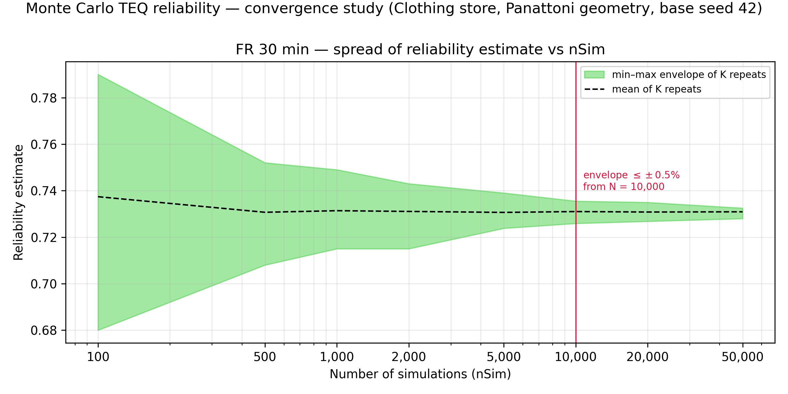

# Monte Carlo TEQ reliability — convergence study

*Scenario:* Panattoni benchmark (Clothing store 64x13x3.5, one openable wall, sect 135, b=1200, 500C, no factors). *Base seed:* 42. *Runtime:* 2795 s. *Repeats per nSim (K):* {'100': 100, '500': 100, '1000': 100, '2000': 100, '5000': 100, '10000': 50, '20000': 50, '50000': 25}.

For each nSim the full reliability run was repeated K times with independent
seeds; the spread of the K estimates measures run-to-run variability at that
nSim. The chart shows the empirical min–max envelope of the K repeats (the
measure used by the precedent CFDOpenPlan appendix study). The 95 %
percentile band is tabulated as a supplementary, K-stable measure; the
recommendation rule runs on the (wider, conservative) envelope.

Tolerance used: envelope half-width ≤ ±0.5% (a guide value, not a hard requirement; all ± values are absolute differences in the reliability percentage).

**Definitions.** *Envelope*: the measured random scatter — the range from
the lowest to the highest answer seen across the K repeats at one nSim
(the shaded band on the chart); half of it is the "min–max half-width".
*95 % band half-width*: as above but using the middle 95 % of the K
repeats instead of the extremes (narrower, less sensitive to one-off
outliers; supplementary only). *K*: how many times the whole reliability
run was repeated, with different random seeds, at each nSim.

| FR (min) | nSim | K | mean | min–max half-width | 95% band half-width |
|---|---|---|---|---|---|
| 30 | 100 | 100 | 73.74% | ±5.50% | ±4.02% |
| 30 | 500 | 100 | 73.07% | ±2.20% | ±1.81% |
| 30 | 1,000 | 100 | 73.14% | ±1.70% | ±1.30% |
| 30 | 2,000 | 100 | 73.11% | ±1.40% | ±1.03% |
| 30 | 5,000 | 100 | 73.06% | ±0.76% | ±0.50% |
| 30 | 10,000 | 50 | 73.10% | ±0.48% | ±0.40% |
| 30 | 20,000 | 50 | 73.08% | ±0.41% | ±0.31% |
| 30 | 50,000 | 25 | 73.09% | ±0.23% | ±0.18% |

## Recommendation

- FR 30 min: min–max envelope half-width first within ±0.5% at **nSim = 10,000**.
