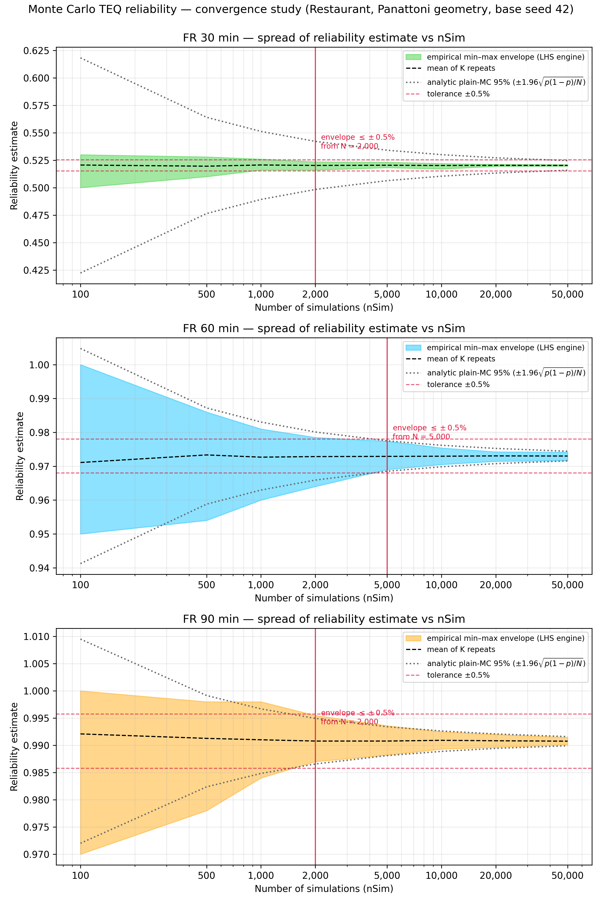

# Monte Carlo TEQ reliability — convergence study

*Scenario:* Panattoni benchmark (Restaurant 64x13x3.5, one openable wall, sect 135, b=1200, 500C, no factors). *Base seed:* 42. *Runtime:* 9643 s. *Repeats per nSim (K):* {'100': 100, '500': 100, '1000': 100, '2000': 100, '5000': 100, '10000': 50, '20000': 50, '50000': 25}.

For each nSim the full reliability run was repeated K times with independent
seeds; the spread of the K estimates measures run-to-run variability at that
nSim. The chart shows the empirical min–max envelope of the K repeats (the
measure used by the precedent CFDOpenPlan appendix study) beside the analytic
plain-Monte-Carlo 95 % interval ±1.96·√(p(1−p)/N) — the engine samples by
Latin Hypercube, so its empirical envelope is expected to sit inside the
analytic curve. The 95 % percentile band is tabulated as a supplementary,
K-stable measure; the acceptance rule runs on the (wider, conservative)
envelope.

Tolerance used: envelope half-width ≤ ±0.5% (all ± values are absolute differences in the reliability percentage).

| FR (min) | nSim | K | mean | min–max half-width | 95% band half-width | analytic 1.96·SE |
|---|---|---|---|---|---|---|
| 30 | 100 | 100 | 52.06% | ±1.50% | ±1.50% | ±9.79% |
| 30 | 500 | 100 | 51.95% | ±0.90% | ±0.70% | ±4.38% |
| 30 | 1,000 | 100 | 52.07% | ±0.50% | ±0.45% | ±3.10% |
| 30 | 2,000 | 100 | 52.02% | ±0.38% | ±0.33% | ±2.19% |
| 30 | 5,000 | 100 | 52.04% | ±0.25% | ±0.21% | ±1.38% |
| 30 | 10,000 | 50 | 52.02% | ±0.25% | ±0.16% | ±0.98% |
| 30 | 20,000 | 50 | 52.03% | ±0.09% | ±0.09% | ±0.69% |
| 30 | 50,000 | 25 | 52.02% | ±0.07% | ±0.06% | ±0.44% |
| 60 | 100 | 100 | 97.11% | ±2.50% | ±2.26% | ±3.18% |
| 60 | 500 | 100 | 97.33% | ±1.60% | ±1.25% | ±1.42% |
| 60 | 1,000 | 100 | 97.27% | ±1.05% | ±0.78% | ±1.00% |
| 60 | 2,000 | 100 | 97.28% | ±0.73% | ±0.60% | ±0.71% |
| 60 | 5,000 | 100 | 97.29% | ±0.42% | ±0.32% | ±0.45% |
| 60 | 10,000 | 50 | 97.30% | ±0.25% | ±0.22% | ±0.32% |
| 60 | 20,000 | 50 | 97.30% | ±0.14% | ±0.12% | ±0.22% |
| 60 | 50,000 | 25 | 97.30% | ±0.13% | ±0.11% | ±0.14% |
| 90 | 100 | 100 | 99.21% | ±1.50% | ±1.00% | ±1.87% |
| 90 | 500 | 100 | 99.13% | ±1.00% | ±0.55% | ±0.84% |
| 90 | 1,000 | 100 | 99.10% | ±0.70% | ±0.40% | ±0.59% |
| 90 | 2,000 | 100 | 99.08% | ±0.43% | ±0.33% | ±0.42% |
| 90 | 5,000 | 100 | 99.08% | ±0.27% | ±0.20% | ±0.27% |
| 90 | 10,000 | 50 | 99.09% | ±0.16% | ±0.14% | ±0.19% |
| 90 | 20,000 | 50 | 99.08% | ±0.12% | ±0.10% | ±0.13% |
| 90 | 50,000 | 25 | 99.08% | ±0.07% | ±0.06% | ±0.08% |

## Recommendation

- FR 30 min: min–max envelope half-width first within ±0.5% at **nSim = 2,000**.
- FR 60 min: min–max envelope half-width first within ±0.5% at **nSim = 5,000**.
- FR 90 min: min–max envelope half-width first within ±0.5% at **nSim = 2,000**.
