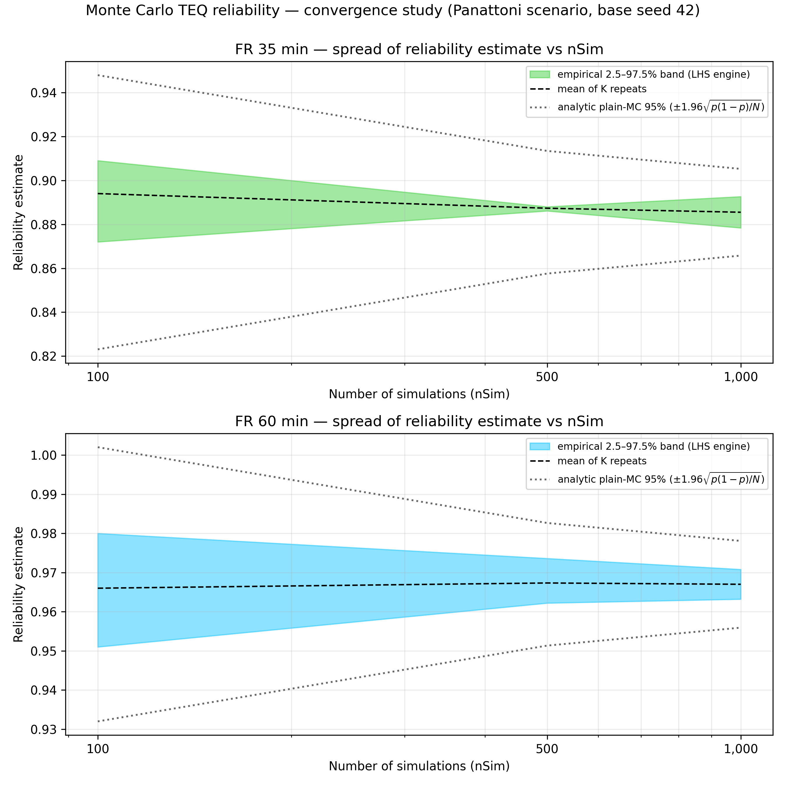

# Monte Carlo TEQ reliability — convergence study

*Scenario:* Panattoni benchmark (Office 64x13x3.5, one openable wall, sect 135, b=1200, 500C, no factors). *Base seed:* 42. *Runtime:* 18 s. *Repeats per nSim (K):* {'100': 5, '500': 3, '1000': 2}.

For each nSim the full reliability run was repeated K times with independent
seeds; the spread of the K estimates measures run-to-run variability at that
nSim. The chart shows the empirical 2.5–97.5 % band beside the analytic
plain-Monte-Carlo 95 % interval ±1.96·√(p(1−p)/N) — the engine samples by
Latin Hypercube, so its empirical band is expected to sit inside the analytic
curve.

Tolerance used: half-band ≤ ±0.5 percentage points.

| FR (min) | nSim | K | mean | 95% band half-width | analytic 1.96·SE |
|---|---|---|---|---|---|
| 35 | 100 | 5 | 0.8940 | ±0.0185 | ±0.0624 |
| 35 | 500 | 3 | 0.8873 | ±0.0010 | ±0.0279 |
| 35 | 1,000 | 2 | 0.8855 | ±0.0071 | ±0.0197 |
| 60 | 100 | 5 | 0.9660 | ±0.0145 | ±0.0350 |
| 60 | 500 | 3 | 0.9673 | ±0.0057 | ±0.0157 |
| 60 | 1,000 | 2 | 0.9670 | ±0.0038 | ±0.0111 |

## Recommendation

- FR 35 min: band half-width first within ±0.5 pp at **nSim = 500**.
- FR 60 min: band half-width first within ±0.5 pp at **nSim = 1,000**.
