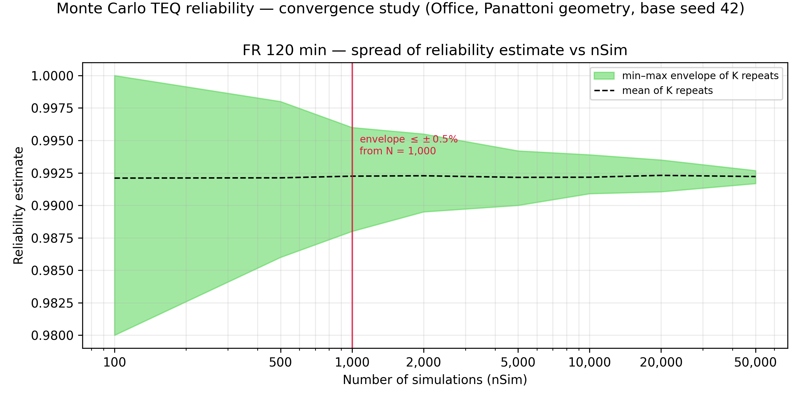

# Monte Carlo TEQ reliability — convergence study

*Scenario:* panattoni benchmark (Office 64x13x3.5, one openable wall, sect 135, b=1200, 500C, no factors). *Base seed:* 42. *Runtime:* 3960 s. *Repeats per nSim (K):* {'100': 100, '500': 100, '1000': 100, '2000': 100, '5000': 100, '10000': 50, '20000': 50, '50000': 25}.

For each nSim the full reliability run was repeated K times with independent
seeds; the spread of the K estimates measures run-to-run variability at that
nSim. The chart shows the empirical min–max envelope of the K repeats (the
measure used by the precedent CFDOpenPlan appendix study). The 95 %
percentile band is tabulated as a supplementary, K-stable measure; the
recommendation rule runs on the (wider, conservative) envelope.

Tolerance used: envelope half-width ≤ ±0.5% (a guide value, not a hard requirement; all ± values are absolute differences in the reliability percentage).

**Definitions.** *Envelope*: the measured random scatter — the range from
the lowest to the highest answer seen across the K repeats at one nSim
(the shaded band on the chart); half of it is the "min–max half-width".
*95 % band half-width*: as above but using the middle 95 % of the K
repeats instead of the extremes (narrower, less sensitive to one-off
outliers; supplementary only). *K*: how many times the whole reliability
run was repeated, with different random seeds, at each nSim.

| FR (min) | nSim | K | mean | min–max half-width | 95% band half-width |
|---|---|---|---|---|---|
| 120 | 100 | 100 | 99.21% | ±1.00% | ±1.00% |
| 120 | 500 | 100 | 99.21% | ±0.60% | ±0.60% |
| 120 | 1,000 | 100 | 99.22% | ±0.40% | ±0.35% |
| 120 | 2,000 | 100 | 99.23% | ±0.30% | ±0.24% |
| 120 | 5,000 | 100 | 99.22% | ±0.21% | ±0.16% |
| 120 | 10,000 | 50 | 99.22% | ±0.15% | ±0.09% |
| 120 | 20,000 | 50 | 99.23% | ±0.12% | ±0.08% |
| 120 | 50,000 | 25 | 99.22% | ±0.05% | ±0.05% |

## Recommendation

- FR 120 min: min–max envelope half-width first within ±0.5% at **nSim = 1,000**.
