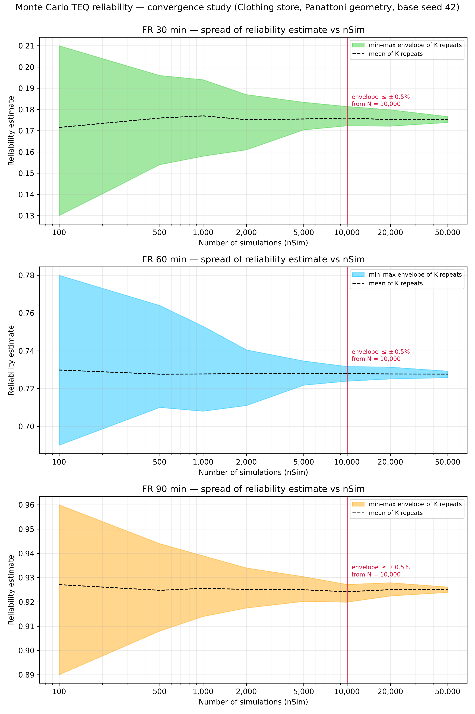

# Monte Carlo TEQ reliability — convergence study

*Scenario:* square benchmark (Clothing store 28.8x28.8x3.5, one openable wall, sect 135, b=1200, 500C, no factors). *Base seed:* 42. *Runtime:* 9155 s. *Repeats per nSim (K):* {'100': 100, '500': 100, '1000': 100, '2000': 100, '5000': 100, '10000': 50, '20000': 50, '50000': 25}.

For each nSim the full reliability run was repeated K times with independent
seeds; the spread of the K estimates measures run-to-run variability at that
nSim. The chart shows the empirical min–max envelope of the K repeats (the
measure used by the precedent CFDOpenPlan appendix study). The 95 %
percentile band is tabulated as a supplementary, K-stable measure; the
recommendation rule runs on the (wider, conservative) envelope.

Tolerance used: envelope half-width ≤ ±0.5% (a guide value, not a hard requirement; all ± values are absolute differences in the reliability percentage).

**Definitions.** *Envelope*: the measured random scatter — the range from
the lowest to the highest answer seen across the K repeats at one nSim
(the shaded band on the chart); half of it is the "min–max half-width".
*95 % band half-width*: as above but using the middle 95 % of the K
repeats instead of the extremes (narrower, less sensitive to one-off
outliers; supplementary only). *K*: how many times the whole reliability
run was repeated, with different random seeds, at each nSim.

| FR (min) | nSim | K | mean | min–max half-width | 95% band half-width |
|---|---|---|---|---|---|
| 30 | 100 | 100 | 17.15% | ±4.00% | ±3.76% |
| 30 | 500 | 100 | 17.59% | ±2.10% | ±1.55% |
| 30 | 1,000 | 100 | 17.70% | ±1.80% | ±1.33% |
| 30 | 2,000 | 100 | 17.52% | ±1.30% | ±0.93% |
| 30 | 5,000 | 100 | 17.55% | ±0.65% | ±0.47% |
| 30 | 10,000 | 50 | 17.59% | ±0.45% | ±0.33% |
| 30 | 20,000 | 50 | 17.52% | ±0.38% | ±0.25% |
| 30 | 50,000 | 25 | 17.54% | ±0.14% | ±0.12% |
| 60 | 100 | 100 | 72.98% | ±4.50% | ±3.76% |
| 60 | 500 | 100 | 72.76% | ±2.70% | ±1.50% |
| 60 | 1,000 | 100 | 72.77% | ±2.25% | ±1.18% |
| 60 | 2,000 | 100 | 72.79% | ±1.47% | ±0.88% |
| 60 | 5,000 | 100 | 72.81% | ±0.64% | ±0.55% |
| 60 | 10,000 | 50 | 72.78% | ±0.39% | ±0.34% |
| 60 | 20,000 | 50 | 72.77% | ±0.31% | ±0.24% |
| 60 | 50,000 | 25 | 72.76% | ±0.17% | ±0.15% |
| 90 | 100 | 100 | 92.71% | ±3.50% | ±2.76% |
| 90 | 500 | 100 | 92.48% | ±1.80% | ±1.35% |
| 90 | 1,000 | 100 | 92.56% | ±1.25% | ±0.93% |
| 90 | 2,000 | 100 | 92.52% | ±0.82% | ±0.70% |
| 90 | 5,000 | 100 | 92.50% | ±0.51% | ±0.37% |
| 90 | 10,000 | 50 | 92.42% | ±0.37% | ±0.29% |
| 90 | 20,000 | 50 | 92.50% | ±0.27% | ±0.19% |
| 90 | 50,000 | 25 | 92.50% | ±0.11% | ±0.11% |

## Recommendation

- FR 30 min: min–max envelope half-width first within ±0.5% at **nSim = 10,000**.
- FR 60 min: min–max envelope half-width first within ±0.5% at **nSim = 10,000**.
- FR 90 min: min–max envelope half-width first within ±0.5% at **nSim = 10,000**.
